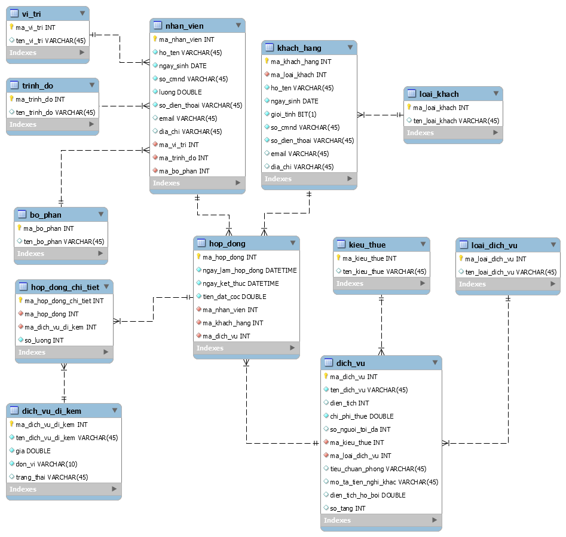

# Module 3 - Database

# Ứng Dụng Quản Lý Khu nghỉ dưỡng Furama

# Mục đích

Học viên sử dụng những kiến thức đã học ở Module 3 - Database để áp dụng
viết các câu lệnh truy vấn SQL.

# Công nghệ phải dùng

Sau khi kết thúc khóa bài tập, học viên sẽ nắm được các kiến thức sau:

  **SQL CƠ BẢN**

  INSERT, SELECT, UPDATE, DELETE cơ bản

  SELECT có điều kiện AND, OR

  SELECT có WHERE và LIKE %

  SELECT có ORDER BY

  SELECT có GROUP BY và HAVING

  SELECT có DISTINCT

  SELECT có INNER JOIN

  SELECT có OUTER JOIN

  SELECT có UNION

  SELECT có EXCEPT hoặc NOT IN, NOT EXISTS

  SELECT có INTERSECT

  SELECT hỗn hợp phức tạp

  **SQL NÂNG CAO**

  INDEX

  VIEWS

  STORED PROCEDURE

  TRANSACTION

  FUNCTION

  CURSOR

# Mô tả hệ thống

Xây dựng hệ thống quản lý khu nghỉ dưỡng Furama tại thành phố Đà Nẵng.
Hệ thống được mô tả như sau:

1.  Khu nghỉ dưỡng Furama sẽ cung cấp các dịch vụ cho thuê bao gồm
    Villa, House, Room.

> Tất cả các dịch vụ này sẽ bao có các thông tin: Tên dịch vụ, Diện tích
> sử dụng, Chi phí thuê, Số lượng người tối đa, Kiểu thuê (bao gồm thuê
> theo năm, tháng, ngày, giờ).

-   Riêng Villa sẽ có thêm thông tin: Tiêu chuẩn phòng, Mô tả tiện nghi
    khác, Diện tích hồ bơi, Số tầng.

-   Riêng House sẽ có thêm thông tin: Tiêu chuẩn phòng, Mô tả tiện nghi
    khác, Số tầng.

-   Riêng Phòng sẽ có thêm thông tin: Dịch vụ miễn phí đi kèm.

> Ngoài ra, resort còn cung cấp các dịch vụ đi kèm như massage, karaoke,
> thức ăn, nước uống, thuê xe di chuyển tham quan resort.
>
> Dịch vụ đi kèm sẽ bao gồm các thông tin: Tên dịch vụ đi kèm, Đơn vị,
> Giá tiền

2.  Hệ thống quản lý còn cho phép quản lý thêm thông tin của Employee
    resort. Thông tin Employee sẽ bao gồm: Họ tên Employee, Ngày sinh,
    Số CMND, Số ĐT, Email, Trình độ, Vị trí, Lương.

> Trình độ sẽ lưu trữ các thông tin: Trung cấp, Cao đẳng, Đại học và sau
> đại học
>
> Vị trí sẽ lưu trữ các thông tin: Lễ tân, phục vụ, chuyên viên, giám
> sát, quản lý, giá đốc.
>
> Mỗi Employee sẽ thuộc một bộ phận làm việc: Hiện tại resort bao gồm
> các bộ phận: Sale -- Marketing, Hành Chính, Phục vụ, Quản lý.

3.  Hệ thống cho phép quản lý thêm thông tin của các Customer đến thuê
    và sử dụng các dịch vụ của Furama. Thông tin của Customer bao gồm:
    Họ tên Customer, Ngày sinh, Giới tính, Số CMND, Số Điện Thoại,
    Email, Loại khách, Địa chỉ (resort sẽ phân loại Customer để áp dụng
    các chính sách phục vụ cho phù hợp).

Loại Customer bao gồm: (Diamond, Platinium, Gold, Silver, Member).

Customer có thể sử dụng các dịch vụ thuê Villa, House, Phòng và các dịch
vụ đi kèm.

Đối với các dịch vụ thuê Villa và House thì Customer cần phải làm hợp
đồng thuê với Furama.

Hợp đồng thuê sẽ bao gồm các thông tin: Số hợp đồng, Ngày bắt đầu, Ngày
kết thúc, Số tiền cọc trước, Tổng số tiền thanh toán.

# Yêu cầu hệ thống

Database mẫu mô tả bài toán hệ thống như sau:

-   Bảng **vi_tri** lưu trữ thông tin vị trí làm tại resort của nhân
    viên.

-   Bảng **trinh_do** lưu trữ thông tin trình độ của nhân viên.

-   Bảng **bo_phan** lưu trữ thông tin nhân viên nào sẽ thuộc phòng ban
    nào.

-   Bảng **nhan_vien** lưu trữ thông tin của nhân viên.

-   Bảng **loai_khach** lưu trữ thông tin các loại khách hàng.

-   Bảng **khach_hang** lưu trữ thông tin của khách hàng.

-   Bảng **hop_dong** lưu trữ thông tin khách hàng thực hiện thuê dịch
    vụ tại resort.

-   Bảng **hop_dong_chi_tiet** lưu trữ thông tin một khách hàng có thể
    thuê nhiều dịch vụ đi kèm.

-   Bảng **dich_vu_di_kem** lưu trữ thông tin các dịch vụ đi kèm khi
    khách hàng thuê Phòng, Villa, House tại resort.

-   Bảng **loai_dich_vu** lưu trữ các loại dịch vụ ở resort.

-   Bảng **kieu_thue** lưu trữ các loại kiểu thuê như: theo giờ, theo
    ngày, theo tháng, theo năm.

-   Bảng **dich_vu** lưu trữ thông tin các dịch vụ mà resort cung cấp.

Thực hiện truy vấn theo yêu cầu sau:

-   SQL CƠ BẢN

1.  Thêm mới thông tin cho tất cả các bảng có trong CSDL để có thể thoả
    mãn các yêu cầu bên dưới.

2.  Hiển thị thông tin của tất cả nhân viên có trong hệ thống có tên bắt
    đầu là **một trong các ký tự "H", "T" hoặc "K"** và có **tối đa 15
    kí tự**.

3.  Hiển thị thông tin của tất cả khách hàng có **độ tuổi từ 18 đến 50
    tuổi** và có địa chỉ ở **"Đà Nẵng" hoặc "Quảng Trị"**.

4.  Đếm xem tương ứng với mỗi khách hàng đã từng đặt phòng bao nhiêu
    lần. Kết quả hiển thị được s**ắp xếp tăng dần theo số lần đặt
    phòng** của khách hàng. Chỉ đếm những khách hàng nào có **Tên loại
    khách hàng** là **"Diamond"**.

5.  Hiển thị **ma_khach_hang, ho_ten, ten_loai_khach, ma_hop_dong,
    ten_dich_vu, ngay_lam_hop_dong, ngay_ket_thuc, tong_tien** (*Với
    tổng tiền được tính theo công thức như sau: Chi Phí Thuê + Số Lượng
    \* Giá, với Số Lượng và Giá là từ bảng dich_vu_di_kem,
    hop_dong_chi_tiet)* cho tất cả các khách hàng đã từng đặt phòng.
    (**những khách hàng nào chưa từng đặt phòng cũng phải hiển thị
    ra**).

6.  Hiển thị **ma_dich_vu, ten_dich_vu, dien_tich, chi_phi_thue,
    ten_loai_dich_vu** của tất cả các loại dịch vụ chưa từng được khách
    hàng thực hiện đặt từ **quý 1 của năm 2021 (Quý 1 là tháng 1, 2,
    3)**.

7.  Hiển thị thông tin **ma_dich_vu, ten_dich_vu, dien_tich,
    so_nguoi_toi_da, chi_phi_thue, ten_loai_dich_vu** của tất cả các
    loại dịch vụ đã từng được khách hàng đặt phòng **trong năm 2020**
    nhưng **chưa từng** được khách hàng **đặt phòng trong năm 2021**.

8.  Hiển thị thông tin **ho_ten** khách hàng có trong hệ thống, với yêu
    cầu **ho_ten không trùng nhau**.

> Học viên sử dụng theo 3 cách khác nhau để thực hiện yêu cầu trên.

9.  Thực hiện thống kê doanh thu theo tháng, nghĩa là tương ứng với mỗi
    tháng trong năm 2021 thì sẽ có bao nhiêu khách hàng thực hiện đặt
    phòng.

10. Hiển thị thông tin tương ứng với từng hợp đồng thì đã sử dụng bao
    nhiêu dịch vụ đi kèm. Kết quả hiển thị bao gồm **ma_hop_dong,
    ngay_lam_hop_dong, ngay_ket_thuc, tien_dat_coc,
    so_luong_dich_vu_di_kem** (*được tính dựa trên việc sum so_luong ở
    dich_vu_di_kem)*.

11. Hiển thị thông tin các dịch vụ đi kèm đã được sử dụng bởi những
    khách hàng có **ten_loai_khach** là **"Diamond"** và có **dia_chi**
    ở **"Vinh" hoặc "Quảng Ngãi".**

12. Hiển thị thông tin **ma_hop_dong**, **ho_ten** (nhân viên),
    **ho_ten** (khách hàng), **so_dien_thoai** (khách hàng),
    **ten_dich_vu, so_luong_dich_vu_di_kem** (*được tính dựa trên việc
    sum so_luong ở dich_vu_di_kem)*, **tien_dat_coc** của tất cả các
    dịch vụ đã từng được khách hàng đặt vào **3 tháng cuối năm 2020
    nhưng chưa từng được khách hàng đặt vào 6 tháng đầu năm 2021**.

13. Hiển thị thông tin các Dịch vụ đi kèm được sử dụng nhiều nhất bởi
    các Khách hàng đã đặt phòng. (*Lưu ý là có thể có nhiều dịch vụ có
    số lần sử dụng nhiều như nhau).*

14. Hiển thị thông tin tất cả các Dịch vụ đi kèm chỉ mới được sử dụng
    một lần duy nhất. Thông tin hiển thị bao gồm **ma_hop_dong,
    ten_loai_dich_vu, ten_dich_vu_di_kem, so_lan_su_dung** (*được tính
    dựa trên việc count các ma_dich_vu_di_kem)*.

15. Hiển thi thông tin của tất cả nhân viên bao gồm **ma_nhan_vien,
    ho_ten, ten_trinh_do, ten_bo_phan, so_dien_thoai, dia_chi** mới chỉ
    lập được **tối đa 3 hợp đồng từ năm 2020 đến 2021**.

16. Xóa những Nhân viên chưa từng lập được hợp đồng nào **từ năm 2019
    đến năm 2021**.

17. Cập nhật thông tin những khách hàng có **ten_loai_khach** từ
    **Platinum** lên **Diamond**, chỉ cập nhật những khách hàng đã từng
    đặt phòng với **Tổng Tiền thanh toán trong năm 2021 là lớn hơn
    10.000.000 VNĐ**.

18. Xóa những khách hàng có hợp đồng **trước năm 2021** (chú ý ràng buộc
    giữa các bảng).

19. Cập nhật giá cho các dịch vụ đi kèm được sử dụng **trên 10 lần trong
    năm 2020 lên gấp đôi**.

20. Hiển thị thông tin của tất cả các nhân viên và khách hàng có trong
    hệ thống, thông tin hiển thị bao gồm **id (ma_nhan_vien,
    ma_khach_hang), ho_ten, email, so_dien_thoai, ngay_sinh, dia_chi**.

-   SQL NÂNG CAO

21. Tạo khung nhìn có tên là **v_nhan_vien** để lấy được thông tin của
    tất cả các nhân viên có địa chỉ là "Hải Châu" và đã từng lập hợp
    đồng cho một hoặc nhiều khách hàng bất kì với ngày lập hợp đồng là
    "12/12/2019".

22. Thông qua khung nhìn **v_nhan_vien** thực hiện cập nhật địa chỉ
    thành "Liên Chiểu" đối với tất cả các nhân viên được nhìn thấy bởi
    khung nhìn này.

23. Tạo Stored Procedure **sp_xoa_khach_hang** dùng để xóa thông tin của
    một khách hàng nào đó với **ma_khach_hang** được truyền vào như là 1
    tham số của **sp_xoa_khach_hang**.

24. Tạo Stored Procedure **sp_them_moi_hop_dong** dùng để thêm mới vào
    bảng **hop_dong** với yêu cầu **sp_them_moi_hop_dong** phải thực
    hiện kiểm tra tính hợp lệ của dữ liệu bổ sung, với nguyên tắc không
    được trùng khóa chính và đảm bảo toàn vẹn tham chiếu đến các bảng
    liên quan.

25. Tạo Trigger có tên **tr_xoa_hop_dong** khi xóa bản ghi trong bảng
    **hop_dong** thì hiển thị tổng số lượng bản ghi còn lại có trong
    bảng **hop_dong** ra giao diện console của database.

> Lưu ý: Đối với MySQL thì sử dụng SIGNAL hoặc ghi log thay cho việc ghi
> ở console.

26. Tạo Trigger có tên **tr_cap_nhat_hop_dong** khi cập nhật ngày kết
    thúc hợp đồng, cần kiểm tra xem thời gian cập nhật có phù hợp hay
    không, với quy tắc sau: Ngày kết thúc hợp đồng phải lớn hơn ngày làm
    hợp đồng ít nhất là 2 ngày. Nếu dữ liệu hợp lệ thì cho phép cập
    nhật, nếu dữ liệu không hợp lệ thì in ra thông báo "Ngày kết thúc
    hợp đồng phải lớn hơn ngày làm hợp đồng ít nhất là 2 ngày" trên
    console của database.

> Lưu ý: Đối với MySQL thì sử dụng SIGNAL hoặc ghi log thay cho việc ghi
> ở console.

27. Tạo Function thực hiện yêu cầu sau:

    a.  Tạo Function **func_dem_dich_vu**: Đếm các dịch vụ đã được sử
        dụng với tổng tiền là \> 2.000.000 VNĐ.

    b.  Tạo Function **func_tinh_thoi_gian_hop_dong**: Tính khoảng thời
        gian dài nhất tính từ lúc bắt đầu làm hợp đồng đến lúc kết thúc
        hợp đồng mà khách hàng đã thực hiện thuê dịch vụ (lưu ý chỉ xét
        các khoảng thời gian dựa vào từng lần làm hợp đồng thuê dịch vụ,
        không xét trên toàn bộ các lần làm hợp đồng). Mã của khách hàng
        được truyền vào như là 1 tham số của function này.

28. Tạo Stored Procedure **sp_xoa_dich_vu_va_hd_room** để tìm các dịch
    vụ được thuê bởi khách hàng với loại dịch vụ là "Room" từ đầu năm
    2015 đến hết năm 2019 để xóa thông tin của các dịch vụ đó (tức là
    xóa các bảng ghi trong bảng **dich_vu**) và xóa những **hop_dong**
    sử dụng dịch vụ liên quan (tức là phải xóa những bản gi trong bảng
    **hop_dong**) và những bản liên quan khác.
